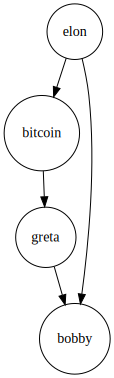
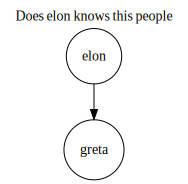
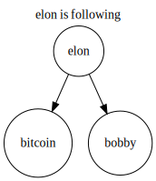
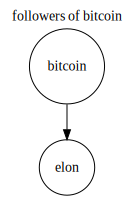

# 🔥🔥🔥 Bobby's Algebraic Graph Toolkit 🔥🔥🔥

#### Setup
Start the tool either using `stack run` if you are building from source, or download it from the releases page.

> If you are on linux and receive `error while loading shared libraries: libtinfo.so.5`
> please install  the `libncurses5` pkg  . The binary is supposed to be statically built
> but one PopOS user reported that it's not working without installing ncurses.


#### Building the graph

Type 

```
follow elon bitcoin
follow elon bobby
follow bitcoin greta
follow greta bobby
```


#### Viewing the graph

Typing `show graph` will generate a link wich will open the
following image:




#### Finding 10 friends of friends

Typing `suggest elon 10` will generate a link wich will open the
following image:




#### Show who Elon is following 

Typing `following elon` will generate a link wich will open the
following image:




#### Show followers of Bitcoin

Typing `followers bitcoin` will generate a link wich will open the
following image:


